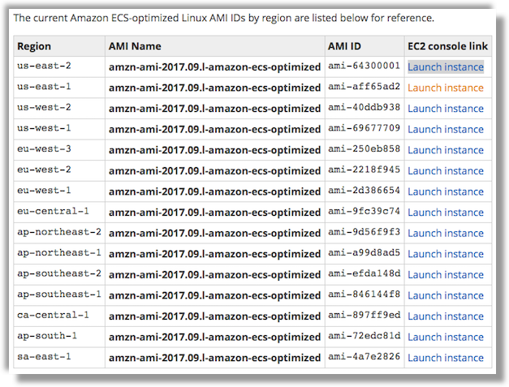

# Creating a custom AMI for genomics

Genomics, the main use case for Cromwell, is a data-heavy workload and requires some modification to the standard AWS Batch processing environment. In particular, we need to scale underlying instance storage that Tasks/Jobs run on top of to meet unpredictable runtime demands.

Specifically we will:

1. Launch and instance with a encrypted EBS volume for scratch space
2. Create a logical volume group using the EBS volume, format it for a filesystem, and adjust the system settings to mount the scratch on instance start.
3. Install and configure a small service to monitor and automatically expand scratch space.
4. Make the necessary adjustments to the Amazon Elastic Container Service (ECS) to work with AWS Batch.
5. Adjust the network settings to allow for containers to query intance metadata for their Task IAM roles.
6. (Optional) Provide the Docker daemon credentials to access private registries such as Docker Hub.

A good starting base for a AWS Batch custom AMI for genomics is the [Amazon ECS-Optimized AMI](https://docs.aws.amazon.com/AmazonECS/latest/developerguide/ecs-optimized_AMI.html). Specifically the Amazon ECS-optimized AMI is preconfigured and tested on Amazon ECS by AWS engineers. It is the simplest AMI for you to get started and to get your containers running on AWS quickly.

The current Amazon ECS-optimized AMI (amzn-ami-2017.09.l-amazon-ecs-optimized) consists of:

* The latest minimal version of the Amazon Linux AMI
* The latest version of the Amazon ECS container agent (1.17.3)
* The recommended version of Docker for the latest Amazon ECS container agent (17.12.1-ce)
* The latest version of the ecs-init package to run and monitor the Amazon ECS agent (1.17.3-1)

## [Step 1.](id:step-1) Getting the AMI ID of an ECS-Optimized AMI for your region

You will need the AMI ID of the latest ECS-Optimized AMI. You can get a list of the current AMI IDs by region on the [documentation page](https://docs.aws.amazon.com/AmazonECS/latest/developerguide/ecs-optimized_AMI.html) documentation page.


[](https://docs.aws.amazon.com/AmazonECS/latest/developerguide/ecs-optimized_AMI.html)

Copy the appropriate AMI ID for the next step (e.g. `ami-aff65ad2`).

## [Step 2.](id:step-2) Create a new Block Device Mapping

```bash
aws ec2 describe-images --image-ids <YOUR AMI ID> \
    --output json \
    --query "Images[0].BlockDeviceMappings" \
    > block-device-mappings.json
```

The `block-device-mappings.json` file looks like this for `ami-aff65ad2`:

```javascript
[
    {
        "DeviceName": "/dev/xvda",
        "Ebs": {
            "Encrypted": false,
            "DeleteOnTermination": true,
            "VolumeType": "gp2",
            "VolumeSize": 8,
            "SnapshotId": "snap-0888b555c45893ab1"
        }
    },
    {
        "DeviceName": "/dev/xvdcz",
        "Ebs": {
            "Encrypted": false,
            "DeleteOnTermination": true,
            "VolumeType": "gp2",
            "VolumeSize": 22
        }
    }
]

```

We will make three changes to the `block-device-mappings.json` file;

1. remove the `Encrypted` key-value pair from the root volume `/dev/xvda` definition
2. encrypt the Docker volume by setting the `Encrypted` flag to be true
3. add another encrypted EBS 10GB volume for scratch space that the containers can use.

The final file should look something like below.

```javascript
[
    {
        "DeviceName": "/dev/xvda",
        "Ebs": {
            "DeleteOnTermination": true,
            "VolumeType": "gp2",
            "VolumeSize": 8,
            "SnapshotId": "snap-0888b555c45893ab1"
        }
    },
    {
        "DeviceName": "/dev/xvdcz",
        "Ebs": {
            "Encrypted": true,
            "DeleteOnTermination": true,
            "VolumeType": "gp2",
            "VolumeSize": 22
        }
    },
    {
        "DeviceName": "/dev/xvdb",
        "Ebs": {
            "Encrypted": true,
            "DeleteOnTermination": true,
            "VolumeType": "gp2",
            "VolumeSize": 10
        }
    }
]

```

## [Step 3.](id:step-3) Launch and configure a new instance for the custom AMI

Next, we will launch an `t2.large` instance with, adding in some more launch parameters on the command line. In particular, we want to include a EC2 user data block to bootstrap the other parts of the installation.

```bash
curl -O https://cromwell-aws-batch.s3.amazonaws.com/files/custom-ami-bootstrap-userdata.txt
aws ec2 run-instances --image-ids <ECS AMI ID FOR REGION> \
    --key-name <YOUR KEY PAIR NAME> \
    --subnet-id <YOUR SUBNET ID> \
    --security-group-ids <YOUR SECURITY GROUP FOR SSH> \
    --block-device-mappings "$(cat block-device-mappings.json)" \
    --instance-type t2.large \
    --associate-public-ip-address \
    --query "Instances[0].InstanceId" \
    --user-data file://custom-ami-bootstrap-userdata.txt
```

The output should provide you with a `InstanceId`. Wait a few minutes (grab yourself some :coffee: or :tea:) and then grab the public IP to SSH into the instance to finish off the custom AMI configuration process.

```bash
INSTANCE_ID=<YOUR INSTANCE ID>
KEY_PAIR=<YOUR KEY PAIR PEM FILE LOCATION>
PUBLIC_DNS=$(aws ec2 describe-instances --instance-id ${INSTANCE_ID} --query "Reservations[0].Instances[0].KeyPair" --output text )

# example SSH session
ssh -i ${KEY_PAIR} ec2-user@${PUBLIC DNS}

# stop the ECS service
sudo stop ecs
# Output:
# ecs stop/waiting

# remove the ECS agent data file
sudo rm -rf /var/lib/ecs/data/ecs_agent_data.json
```

Your instance is now ready for image creation.

<table>
<tr><th> :hamburger: Note </th></tr>
<tr><td>
If you want to leverage <b>private Docker registries</b>, see
<A href="#XXX"> section XXX</a>
below on how to configure you instance to be able to do this prior to making an AMI image.
</td></tr>
</table>

## [Step 4.](id:step-4) Create a new Amazon Machine Image for Batch

Exit the SSH session and create a new AMI from your development machine using the AWS CLI.

```bash
# From your development machine
aws ec2 create-image --instance-id ${INSTANCE_ID} \
                     --name "cromwell-aws-$(date '+%Y%m%d-%H%M%S')" \
                     --description "A custom AMI for use with Cromwell on AWS Batch"
                     --no-reboot
# Output:
# {
#     "ImageId": "ami-123abc456"
# }
```

Make a note of the AMI ID that was returned, we will need it for future sections.
