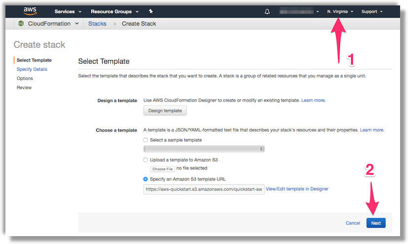
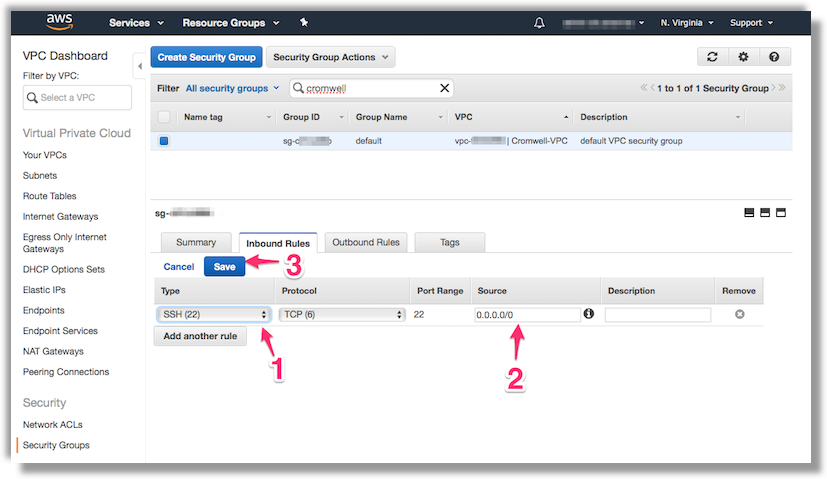
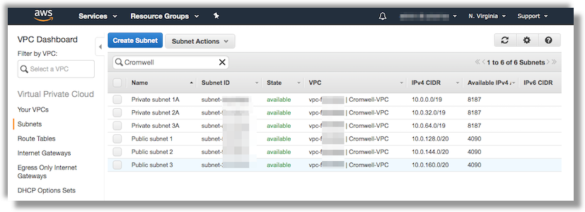

# Creating a AWS environment for Cromwell

## Step 1. A AWS account

If you do not have one already, [create an AWS Account](https://portal.aws.amazon.com/billing/signup#/start).

## Step 2. Setting up the AWS IAM user and AWS CLI

Next we need to set up your development environment, which means creating an  [AWS Identity and Access Management (IAM)](https://docs.aws.amazon.com/IAM/latest/UserGuide/introduction.html) user for use with Cromwell, and the [AWS Command Line Interface (AWS CLI)](https://aws.amazon.com/cli/).

The easiest way to accomplish this follow [Step 1](https://aws.amazon.com/getting-started/tutorials/backup-to-s3-cli/#Step_1\:_Create_an_AWS_IAM_User) and [Step 2](https://aws.amazon.com/getting-started/tutorials/backup-to-s3-cli/#install-cli) of the ["Batch upload files to the cloud"](https://aws.amazon.com/getting-started/tutorials/backup-to-s3-cli/) 10-minute tutorial.

<table>
<tr><th>
:fire:  <span style="color: red;" >WARNING</span>
</th><td>
We <b>strongly</b> recommend following the
<a href='https://docs.aws.amazon.com/IAM/latest/UserGuide/best-practices.html'>IAM Security Best Practices</a> for securing your root AWS account and IAM users.
</td></tr>
</table>


<table>
<tr><th>
:pushpin:  <span style="color: blue;" >NOTE</span>
</th><td>
The rest of the tutorial walks through a simple exercise that shows how to create a <a href="https://aws.amazon.com/s3/"> Amazon S3</a> bucket and upload files to it using the AWS CLI. You can take this opportunity to upload some sequence data to S3 for analysis. :wink:
</td></tr>
</table>

## Step 3. Create a EC2 Key Pair

In order to SSH to virtual machines on AWS, you will need to create a [EC2 Key Pair](https://docs.aws.amazon.com/AWSEC2/latest/UserGuide/ec2-key-pairs.html).

```shell
aws ec2 create-key-pair --key-name MyKeyPair --output text --query "KeyMaterial" > ${HOME}/MyKeyPair.pem
chmod 600 ${HOME}/MyKeyPair.pem
```

The above will create a new EC2 Key Pair named "MyKeyPair", will write out the RSA Private Certificate file into your root home directory, and change the permissions so that only you will be able to read the contents.

Make a note of the file location, as you will need it later.

## Step 4. Creating a VPC for Cromwell

While you can use an existing VPC to implement a Cromwell deployment, this tutorial assumes that you have a clean environment and VPC with public and private subnets. We recommend the use of the AWS Quickstart reference deployment for a [Modular and Scalable VPC Architecture](https://aws.amazon.com/quickstart/architecture/vpc/). This Quick Start provides a networking foundation for AWS Cloud infrastructures. It deploys an Amazon Virtual Private Cloud (Amazon VPC) according to AWS best practices and guidelines.

The Amazon VPC reference architecture includes public and private subnets. The first set of private subnets share the default network access control list (ACL) from the Amazon VPC, and a second, optional set of private subnets include dedicated custom network ACLs per subnet. The Quick Start divides the Amazon VPC address space in a predictable manner across multiple Availability Zones, and deploys either NAT instances or NAT gateways, depending on the AWS Region you deploy the Quick Start in.

For architectural details, best practices, step-by-step instructions, and customization options, see the
[deployment guide](https://fwd.aws/9VdxN).

Click on the "Launch Quick Start" link, confirm that you are in your preferred AWS Region, and click "Next"



Next, fill in a custom name for the CloudFormation stack, in this example we use "Cromwell-VPC". We also select a set of VPC Availability Zones and adjust the number to match the amount we picked (up to four).


Scroll down to the bottom of the form and choose the EC2 Key Pair Name that you created in [Step 3](#step-3).


Click through the rest of the wizard, the defaults are fine. Once the CloudFormation Stack creation completes, head on over to the [VPC Web console](https://console.aws.amazon.com/vpc/home?) to make note of the subnet IDs and security group for the Cromwell VPC. While we are there, we will adjust the default security group to accept SSH connections.





Make a note of how to get these values for later.

<table>
<tr><th>
:bulb:  <span style="color: orange;" >TIP</span>
</th><td>

You may also want to review the  <a href="https://aws.amazon.com/quickstart/architecture/accelerator-hipaa/" > HIPAA on AWS Enterprise Accelerator </a>
for additional security best practices such as:
<ul>
<li> Basic AWS Identity and Access Management (IAM) configuration with custom (IAM) policies, with associated groups, roles, and instance profiles</li>
<li> Standard, external-facing Amazon Virtual Private Cloud (Amazon VPC) Multi-AZ architecture with separate subnets for different application tiers and private (back-end) subnets for application and database</li>
<li> Amazon Simple Storage Service (Amazon S3) buckets for encrypted web content, logging, and backup data</li>
<li> Standard Amazon VPC security groups for Amazon Elastic Compute Cloud (Amazon EC2) instances and load balancers used in the sample application stack</li>
<li> A secured bastion login host to facilitate command-line Secure Shell (SSH) access to Amazon EC2 instances for troubleshooting and systems administration activities</li>
<li> Logging, monitoring, and alerts using AWS CloudTrail, Amazon CloudWatch, and AWS Config rules</li>
</ul>
</td></tr>
</table>


## Step 4. Ability to SSH into a Linux server

We assume that you are able to use the Key Pair created above to connect to Linux instances on AWS via SSH.

If you are unsure about how this works, we recommend the ["Launch a Linux Virtual Machine"](https://aws.amazon.com/getting-started/tutorials/launch-a-virtual-machine/) tutorial which walks users through the process of starting a host on AWS, and configuring your own computer to connect over SSH.
