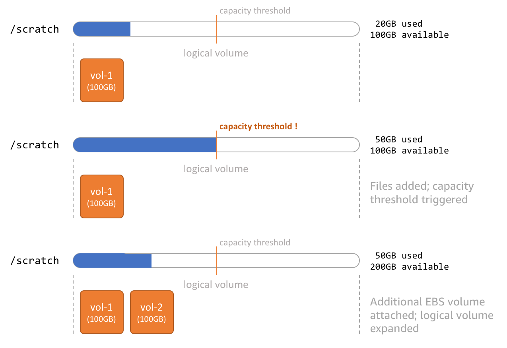

# Custom Compute Resources

Genomics is a data-heavy workload and requires some modification to the defaults
used by AWS Batch for job processing.  To efficiently use resources, AWS Batch places multiple jobs on an worker instance.  The data requirements for individual jobs can range from a few MB to 100s of GB.  Instances running workflow jobs will not know beforehand how much space is required, and need scalable storage to meet unpredictable runtime demands.

To handle this use case, we can use a process that monitors a scratch directory on an instance and expands free space as needed based on capacity thresholds. This can be done using logical volume management and attaching EBS volumes as needed to the instance like so:



The above process - "EBS autoscaling" - requires a few small dependencies and a simple daemon installed on the host instance.

By default, AWS Batch uses the [Amazon ECS-Optimized AMI](https://docs.aws.amazon.com/AmazonECS/latest/developerguide/ecs-optimized_AMI.html)
to launch instances for running jobs.  This is sufficient in most cases, but specialized needs, such as the large storage requirements noted above, require customization of the base AMI.  Because the provisioning requirements for EBS autoscaling are fairly simple and light weight, one can use an EC2 Launch Template to customize instances.

## EC2 Launch Template

The simplest method for customizing an instance is to use an EC2 Launch Template.
This works best if your customizations are relatively light - such as installing
a few small utilities or making specific configuration changes.

This is because Launch Templates run a `UserData` script when an instance first launches.
The longer these scripts / customizations take to complete, the longer it will
be before your instance is ready for work.

Launch Templates are capable of pre-configuring a lot of EC2 instance options.
Since this will be working with AWS Batch, which already does a lot of automatic 
instance configuration on its own, you only need to supply the `UserData`
script below:

```text
MIME-Version: 1.0
Content-Type: multipart/mixed; boundary="==BOUNDARY=="

--==BOUNDARY==
Content-Type: text/cloud-config; charset="us-ascii"

packages:
- jq
- btrfs-progs
- python27-pip
- sed
- wget
# add more package names here if you need them

runcmd:
- pip install -U awscli boto3
- cd /opt && wget https://aws-genomics-workflows.s3.amazonaws.com/artifacts/aws-ebs-autoscale.tgz && tar -xzf aws-ebs-autoscale.tgz
- sh /opt/ebs-autoscale/bin/init-ebs-autoscale.sh /scratch /dev/sdc  2>&1 > /var/log/init-ebs-autoscale.log
# you can add more commands here if you have additional provisioning steps

--==BOUNDARY==--
```

The above will add an `ebs-autoscale` daemon to an instance.  By default it will 
add a 20GB EBS volume to the logical volume mounted at `/scratch`.  
If you want this volume to be larger initially, you can specify a bigger one 
mapped to `/dev/sdc`  the Launch Template.

!!! note
    The mount point is specific to what orchestration method / engine you intend to use.  `/scratch` is considered a generic default.  If you are using a 3rd party workflow orchestration engine this mount point will need to be adjusted to fit that engine's expectations.

Also note that the script has MIME multi-part boundaries.  This is because AWS Batch will combind this script with others that it uses to provision instances.

## Creating an EC2 Launch Template

Instructions on how to create a launch template are below.  Once your Launch Template is created, you can reference it when you setup resources in AWS Batch to ensure that jobs run therein have your customizations available
to them.

### Automated via CloudFormation

You can use the following CloudFormation template to create a Launch Template
suitable for your needs.

| Name | Description | Source | Launch Stack |
| -- | -- | :--: | :--: |
{{ cfn_stack_row("EC2 Launch Template", "GWFCore-LT", "aws-genomics-launch-template.template.yaml", "Creates an EC2 Launch Template that provisions instances on first boot for processing genomics workflow tasks.") }}

### Manually via the AWS CLI

In most cases, EC2 Launch Templates can be created using the AWS EC2 Console.
For this case, we need to use the AWS CLI.

Create a file named `launch-template-data.json` with the following contents:

```json
{
  "TagSpecifications": [
    {
      "ResourceType": "instance",
      "Tags": [
        {
          "Key": "architecture",
          "Value": "genomics-workflow"
        },
        {
          "Key": "solution",
          "Value": "nextflow"
        }
      ]
    }
  ],
  "BlockDeviceMappings": [
    {
      "Ebs": {
        "DeleteOnTermination": true,
        "VolumeSize": 50,
        "VolumeType": "gp2"
      },
      "DeviceName": "/dev/xvda"
    },
    {
      "Ebs": {
        "Encrypted": true,
        "DeleteOnTermination": true,
        "VolumeSize": 75,
        "VolumeType": "gp2"
      },
      "DeviceName": "/dev/xvdcz"
    },
    {
      "Ebs": {
        "Encrypted": true,
        "DeleteOnTermination": true,
        "VolumeSize": 20,
        "VolumeType": "gp2"
      },
      "DeviceName": "/dev/sdc"
    }
  ],
  "UserData": "...base64-encoded-string..."
}
```

The above template will create an instance with three attached EBS volumes.

* `/dev/xvda`: will be used for the root volume
* `/dev/xvdcz`: will be used for the docker metadata volume
* `/dev/sdc`: will be the initial volume use for scratch space (more on this below)

The `UserData` value should be the `base64` encoded version of the UserData script used to provision instances.

Use the command below to create the corresponding launch template:

```bash
aws ec2 \
    create-launch-template \
        --launch-template-name genomics-workflow-template \
        --launch-template-data file://launch-template-data.json
```

You should get something like the following as a response:

```json
{
    "LaunchTemplate": {
        "LatestVersionNumber": 1, 
        "LaunchTemplateId": "lt-0123456789abcdef0", 
        "LaunchTemplateName": "genomics-workflow-template", 
        "DefaultVersionNumber": 1, 
        "CreatedBy": "arn:aws:iam::123456789012:user/alice", 
        "CreateTime": "2019-01-01T00:00:00.000Z"
    }
}
```

## Custom AMIs

A slightly more involved method for customizing an instance is
to create a new AMI based on the ECS Optimized AMI.  This is good if you have 
a lot of customization to do - lots of software to install and/or need large 
datasets preloaded that will be needed by all your jobs.

You can learn more about how to [create your own AMIs in the EC2 userguide](https://docs.aws.amazon.com/AWSEC2/latest/UserGuide/AMIs.html).

!!! note
    This is considered advanced use.  All documentation and CloudFormation templates hereon assumes use of EC2 Launch Templates.
