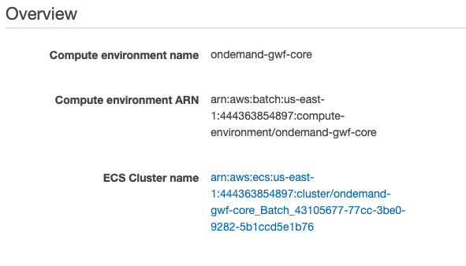
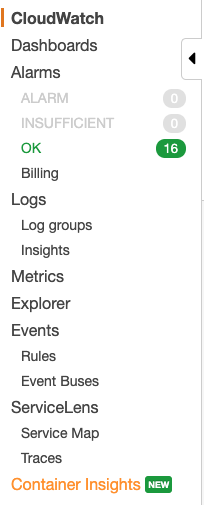
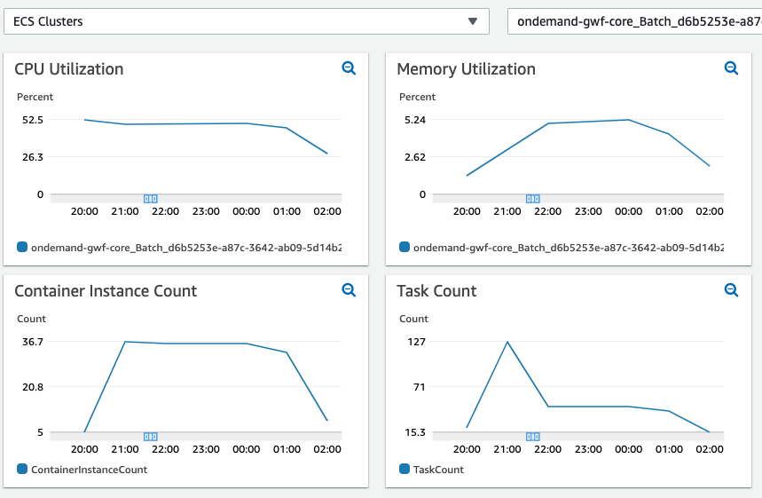

# Optimizing AWS Batch Resources for Cost Effective Cromwell Workflows

Tasks in a Cromwell workflow run in Docker containers. Each task contains a `runtime` definition that specifies the 
number of CPUs and amount of RAM allocated to the task. 

```
  runtime {
    docker: "biocontainers/plink1.9:v1.90b6.6-181012-1-deb_cv1"
    memory: "8 GB"
    cpu: 2
  }
```

The amount of resource allocated to each container ultimately impacts the cost to run a workflow. Optimally allocating 
resources leads to cost efficiency. The following suggestions can help to “right size” your workflow.

## Optimize the longest running and most parallel tasks first

With AWS Batch you pay for what you use so it makes most sense to focus on those tasks that run the longest as well as those 
that have the largest scatters (parallel tasks) as they will make up the majority of the workflow runtime and contribute
 most to the cost.

## Enable CloudWatch Container Insights

CloudWatch container insights provides detailed monitoring of ECS clusters as well as containers running on those 
clusters. Because AWS Batch compute environments are managed ECS clusters, enabling container insights on those 
clusters will show how the cluster is being utilized during a workflow run. Currently cluster insights can be enabled 
using the AWS CLI. To do this we need the name of the ECS cluster that is managed by the AWS Batch Compute Environment.


1. From the AWS Batch console, identify the Compute Environment(s) of interest
    
    
1. Click on the link of the environment and note the ECS Cluster Name
    
    
1. Enable cluster insights with the following command

`aws ecs update-cluster-settings --cluster **ECS-CLUSTER-NAME** --settings name=containerInsights,value=enabled`

### Using Container Insights

With Container Insights enabled metrics can be viewed in the CloudWatch console and used to determine if resources are 
under or over allocated.

1. From the side bar of the CloudWatch console click **Container Insights** and **View Performance Dashboards**

    

1. From the dropdown select **ECS Clusters** to view the Cluster utilization. Select a time range corresponding to a 
Cromwell Workflow run.

    
    
    Using the **ECS Clusters** Dashboard we can see the utilization of each EC2 worker in the cluster. The CPU 
    utilization averages about 50% suggesting that the containers may not be efficiently packed (see below for tips on
     packing), the containers have too much CPU allocated or both. The memory utilization is very low so memory 
     is over allocated. Container instance count shows the average number of EC2 workers hosting containers, 
     and the task count is the number of tasks running in containers at that time.
     
    
    
1. From the dropdown select **ECS Tasks** to view the container utilization. Select a time range corresponding to a 
Cromwell Workflow run.
    
    Using the **ECS Tasks** Dashboard we can gain insight into the average activity within the containers during 
    the workflow. In this case we again see that memory is over allocated and CPU could potentially be reduced.
    
    

## Consider CPU and memory ratios

EC2 workers for Cromwell AWS Batch compute environments are drawn from `c`, `m`, and `r` instance families and these 
have vCPU to memory ratios of 1:2, 1:4 and 1:8 respectively. AWS Batch will attempt to fit containers to instances in 
the most optimal way depending on cost and size requirements. Given that a task requiring 16GB of RAM that could make 
use of all available CPUs, then to optimally pack the containers you should specify either 2, 4, or 8 vCPU. Other 
values could lead to inefficient packing meaning the resources of the EC2 container instance are being paid for but 
not optimally used.

## Split tasks that pipe output

If a workflow task consists of a process that pipes STDOUT to another process then both processes will run in the same 
container and receive the same resources. If one task requires more resources than the other this might be inefficient 
and  might be better divided into two tasks each with its own `runtime` configuration. Note that this will require the 
intermediate STDOUT to be written to a file and copied between containers so if this output is very large then keeping 
the processes in the same task may be more efficient.

## Use the most cost effective instance generation

Fifth generation EC2 types (`c5`, `m5`, `r5`) have a lower on demand price and have higher clock speeds than their 4th 
generation counterparts (`c4`, `m4`, `r4`). Therefore for on demand compute environments those instance types should be 
preferred. In spot compute environments we suggest using both 4th and 5th generation types as this increases the pool of
 available types meaning Batch will be able to choose the instance type that is cheapest and least likely to be 
 interrupted. In addition, using all available availability zones for a AWS Batch compute environment will also give 
 AWS Batch a wider selection of Spot instances to choose from.
 
