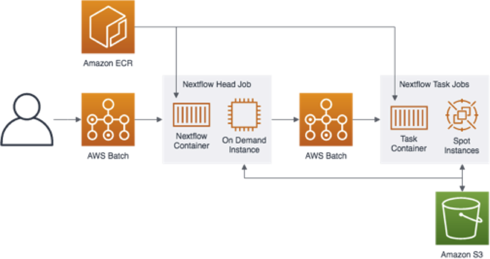

# Nextflow on AWS Batch



[Nextflow](https://www.nextflow.io) is a reactive workflow framework and DSL developed by the [Comparative Bioinformatics group](https://www.crg.eu/en/programmes-groups/notredame-lab) at the Barcelona [Centre for Genomic Regulation (CRG)](http://www.crg.eu/) that enables scalable and reproducible scientific workflows using software containers. It allows the adaptation of pipelines written in the most common scripting languages.

## Full Stack Deployment (TL;DR)

The following CloudFormation template will launch a EC2 instance pre-configured for using Nextflow.

| Name | Description | Source | Launch Stack |
| -- | -- | :--: | -- |
{{ cfn_stack_row("Nextflow All-in-One", "Nextflow", "nextflow/nextflow-aio.template.yaml", "Create all resources needed to run Nextflow on AWS: an S3 Bucket for data, S3 Bucket for nextflow config and workflows, AWS Batch Environment, and Nextflow head node job definition and job role") }}

When the above stack is complete, you will have a preconfigured Batch Job Definition that you can use to launch Nextflow pipelines.  Skip to the [Running a workflow](#running-a-workflow) section below to learn how.

## Requirements

To get started using Nextflow on AWS you'll need the following setup in your AWS account:

* The core set of resources (S3 Bucket, IAM Roles, AWS Batch) described in the [Getting Started](../../../core-env/introduction) section.
* Containerized Nextflow that pulls configuration and workflow definitions from S3
* AWS CLI installed in job instances using `conda`
* A Batch Job Definition that runs a Nextflow head node
* An IAM Role for the Nextflow head node job that allows it access to AWS Batch
* (optional) An S3 Bucket to store your Nextflow workflow definitions and configuration

### Nextflow container

```Dockerfile
FROM centos:7

RUN yum update -y \
 && yum install -y \
    curl \
    java-1.8.0-openjdk \
    awscli \
 && yum clean -y all

ENV JAVA_HOME /usr/lib/jvm/jre-openjdk/

WORKDIR /opt/inst
RUN curl -s https://get.nextflow.io | bash
RUN mv nextflow /usr/local/bin

COPY nextflow.aws.sh /opt/bin/nextflow.aws.sh
RUN chmod +x /opt/bin/nextflow.aws.sh

WORKDIR /opt/work
ENTRYPOINT ["/opt/bin/nextflow.aws.sh"]
```

where the entrypoint script is:

```bash
#!/bin/bash

# $1) config S3 path
# $2) workflow S3 path

NEXTFLOW_CONFIG=$1
NEXTFLOW_SCRIPT=$2

# stage config and workflow definition
aws s3 cp --no-progress $NEXTFLOW_CONFIG .
aws s3 cp --no-progress $NEXTFLOW_SCRIPT .

NF_FILE=$(find . -name "*.nf")

nextflow run $NF_FILE
```

### Batch job definition

```json
{
    "jobDefinitionName": "nextflow",
    "jobDefinitionArn": "arn:aws:batch:us-west-2:<account-number>:job-definition/nextflow:1",
    "revision": 1,
    "status": "ACTIVE",
    "type": "container",
    "parameters": {
        "NextflowConfig": "s3://<bucket-name>/nextflow/nextflow.config",
        "NextflowScript": "s3://<bucket-name>/nextflow/workflow.nf"
    },
    "containerProperties": {
        "image": "<dockerhub-user>/nextflow:latest",
        "vcpus": 2,
        "memory": 1024,
        "command": [
            "Ref::NextflowConfig",
            "Ref::NextflowScript"
        ],
        "volumes": [
            {
                "host": {
                    "sourcePath": "/scratch"
                },
                "name": "scratch"
            }
        ],
        "environment": [],
        "mountPoints": [
            {
                "containerPath": "/opt/work",
                "sourceVolume": "scratch"
            }
        ],
        "ulimits": []
    }
}
```

### Configuration

```groovy
process.executor = 'awsbatch'
process.queue = 'my-default-batch-queue'

aws.region = 'us-west-2'

// AWS CLI tool is installed via the instance launch template
executor.awscli = '/home/ec2-user/miniconda/bin/aws'
```

## Running a workflow

### Starting a workflow

### Workflow process definitions

```groovy
texts = Channel.from("AWS", "Nextflow")

process hello {
    // directives
    container "ubuntu:latest"

    // batch task config
    cpus 1
    memory '512 MB'

    input:
    val text from texts

    output:
    file 'hello.txt'

    """
    echo "Hello $text" > hello.txt
    """
}
```