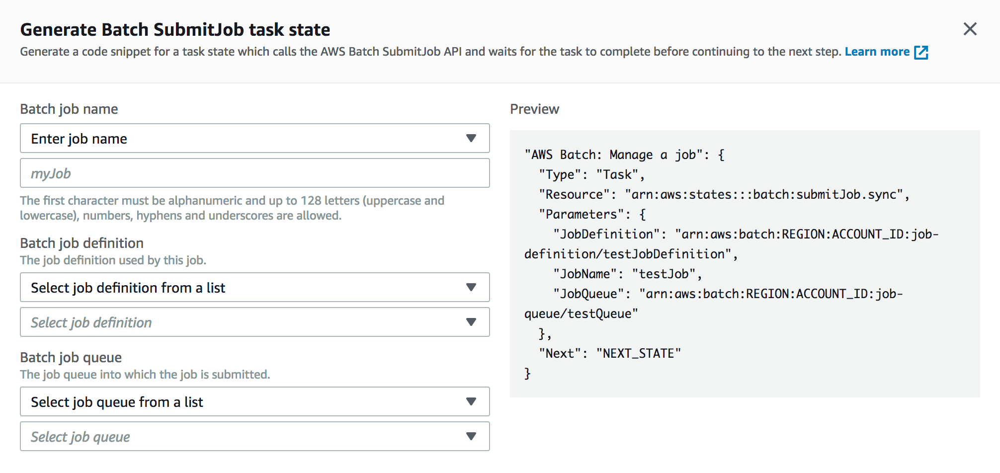
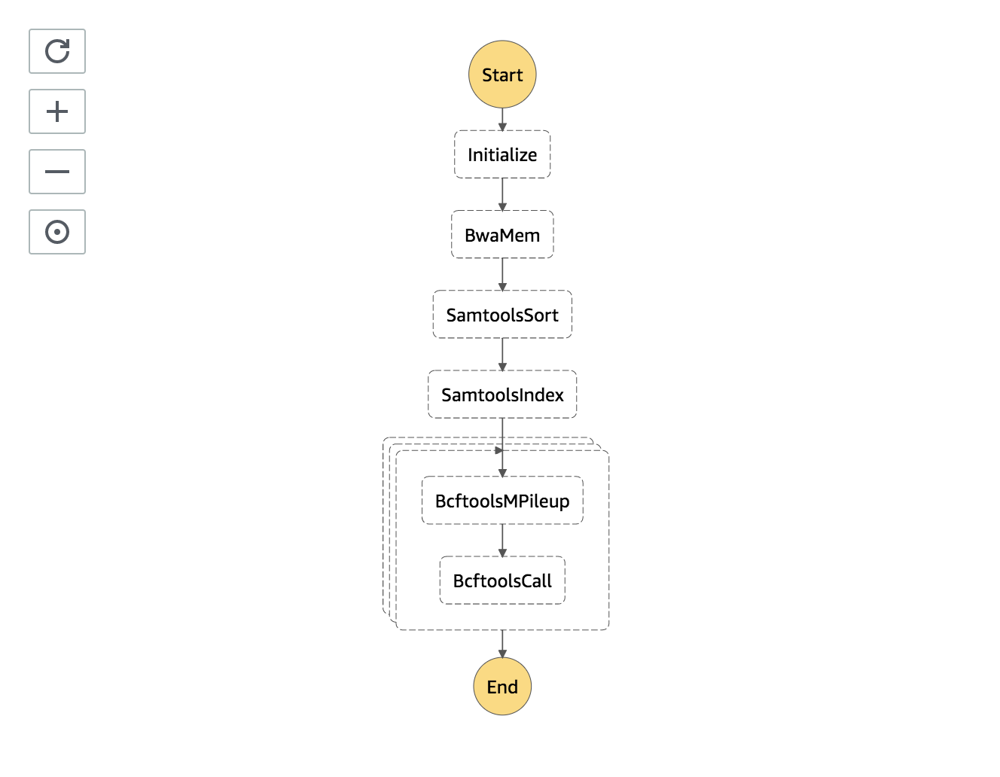
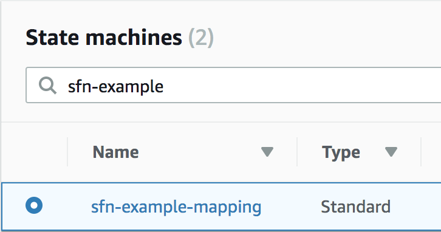
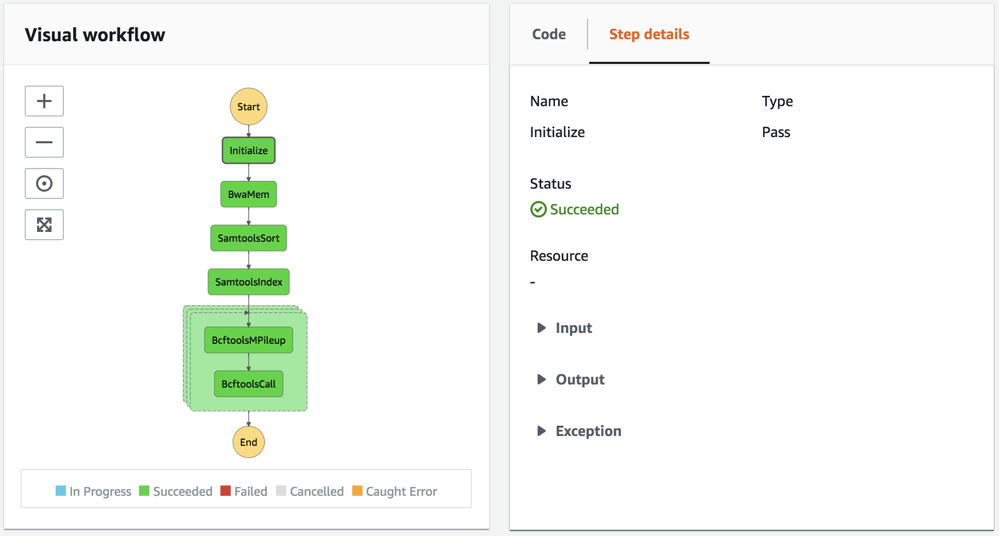

# AWS Step Functions For Genomics Workflows


[AWS Step Functions](https://aws.amazon.com/step-functions/) is a service that allows you to orchestrate other AWS services, such as Lambda, Batch, SNS, and Glue, making it easy to coordinate the components of distributed applications as a series of steps in a visual workflow.

In the context of genomics workflows, the combination of AWS Step Functions with Batch and Lambda constitutes a robust, scalable, and serverless task orchestration solution.

## Full Stack Deployment

If you need something up and running in a hurry, the follwoing CloudFormation template will create everything you need to run an example genomics workflow using `bwa-mem`, `samtools`, and `bcftools`.

| Name | Description | Source | Launch Stack |
| -- | -- | :--: | :--: |
{{ cfn_stack_row("AWS Step Functions All-in-One Example", "AWSGenomicsWorkflow", "step-functions/sfn-aio.template.yaml", "Create all resources needed to run a genomics workflow with Step Functions: an S3 Bucket, AWS Batch Environment, State Machine, Batch Job Definitions, and container images") }}

Another example that uses a scripted setup process is provided at this GitHub repository:

[AWS Batch Genomics](https://github.com/aws-samples/aws-batch-genomics)


If you are interested in creating your own solution with AWS Step Functions and AWS Batch,
read through the rest of this page.

## Prerequisites

To get started using AWS Step Functions for genomics workflows you'll need the following setup in your AWS account:

* The core set of resources (S3 Bucket, IAM Roles, AWS Batch) described in the [Getting Started](../../../core-env/introduction/) section.

## AWS Step Functions Execution Role

An AWS Step Functions Execution role is an IAM role that allows Step Functions to execute other AWS services via the state machine.

This can be created automatically during the "first-run" experience in the AWS Step Functions console when you create your first state machine.  The policy attached to the role will depend on the specifc tasks you incorporate into your state machine.

State machines that use AWS Batch for job execution and send events to CloudWatch should have an Execution role with the following inline policy:

```json
{
    "Version": "2012-10-17",
    "Statement": [
        {
            "Sid": "enable submitting batch jobs",
            "Effect": "Allow",
            "Action": [
                "batch:SubmitJob",
                "batch:DescribeJobs",
                "batch:TerminateJob"
            ],
            "Resource": "*"
        },
        {
            "Effect": "Allow",
            "Action": [
                "events:PutTargets",
                "events:PutRule",
                "events:DescribeRule"
            ],
            "Resource": [
                "arn:aws:events:<region>:<account-number>:rule/StepFunctionsGetEventsForBatchJobsRule"
            ]
        }
    ]
}
```

For more complex workflows that use nested workflows or require more complex input parsing, you need to add additional permissions for executing Step Functions State Machines and invoking Lambda functions:

```json
{
    "Version": "2012-10-17",
    "Statement": [
        {
            "Sid": "enable calling lambda functions",
            "Effect": "Allow",
            "Action": [
                "lambda:InvokeFunction"
            ],
            "Resource": "*"
        },
        {
            "Sid": "enable calling other step functions",
            "Effect": "Allow",
            "Action": [
                "states:StartExecution"
            ],
            "Resource": "*"
        },
        ...
    ]
}
```

!!! note
    All `Resource` values in the policy statements above can be scoped to be more specific if needed.

## Step Functions State Machine

Workflows in AWS Step Functions are built using [Amazon States Language](https://docs.aws.amazon.com/step-functions/latest/dg/concepts-amazon-states-language.html) (ASL), a declarative, JSON-based, structured language used to define a "state-machine".  An AWS Step Functions State-Machine is a collection of states that can do work (Task states), determine which states to transition to next (Choice states), stop an execution with an error (Fail states), and so on.

### Building workflows with AWS Step Functions

The overall structure of a state-machine looks like the following:

```json
{
  "Comment": "Description of you state-machine",
  "StartAt": "FirstState",
  "States": {
    "FirstState": {
        "Type": "<state-type>",
        "Next": "<name of next state>"
    },

    "State1" : {
        ...
    },
    ...

    "StateN" : {
        ...
    },

    "LastState": {
        ...
        "End": true
    }
  }
}
```

A simple "Hello World" state-machine looks like this:

```json
{
  "Comment": "A Hello World example of the Amazon States Language using a Pass state",
  "StartAt": "HelloWorld",
  "States": {
    "HelloWorld": {
      "Type": "Pass",
      "Result": "Hello World!",
      "End": true
  }
}
```

ASL supports several task types and simple structures that can be combined to form a wide variety of complex workflows.


More detailed coverage of ASL state types and structures is provided in the 
Step Functions [ASL documentation](https://docs.aws.amazon.com/step-functions/latest/dg/concepts-amazon-states-language.html).

### Batch Job Definitions

[AWS Batch Job Definitions](https://docs.aws.amazon.com/batch/latest/userguide/job_definitions.html) are used to define compute resource requirements and parameter defaults for an AWS Batch Job.  These are then referenced in state machine `Task` states by their respective ARNs.

An example Job Definition for the `bwa-mem` sequence aligner is shown below:

```json
{
    "jobDefinitionName": "bwa-mem",
    "type": "container",
    "parameters": {
        "threads": "8"
    },
    "containerProperties": {
        "image": "<dockerhub-user>/bwa-mem:latest",
        "vcpus": 8,
        "memory": 32000,
        "command": [
            "bwa", "mem",
            "-t", "Ref::threads",
            "-p",
            "reference.fasta",
            "sample_1.fastq.gz"
        ],
        "volumes": [
            {
                "host": {
                    "sourcePath": "/scratch"
                },
                "name": "scratch"
            },
            {
                "host": {
                    "sourcePath": "/opt/miniconda"
                },
                "name": "aws-cli"
            }
        ],
        "environment": [
            {
                "name": "REFERENCE_URI",
                "value": "s3://<bucket-name>/reference/*"
            },
            {
                "name": "INPUT_DATA_URI",
                "value": "s3://<bucket-name>/<sample-name>/fastq/*.fastq.gz"
            },
            {
                "name": "OUTPUT_DATA_URI",
                "value": "s3://<bucket-name>/<sample-name>/aligned"
            }
        ],
        "mountPoints": [
            {
                "containerPath": "/opt/work",
                "sourceVolume": "scratch"
            },
            {
                "containerPath": "/opt/miniconda",
                "sourceVolume": "aws-cli"
            }
        ],
        "ulimits": []
    }
}
```

There are three key parts of the above definition to take note of.

* Command and Parameters

    The **command** is a list of strings that will be sent to the container.  This is the same as the `...` arguments that you would provide to a `docker run mycontainer ...` command.

    **Parameters** are placeholders that you define whose values are substituted when a job is submitted.  In the case above a `threads` parameter is defined with a default value of `8`.  The job definition's `command` references this parameter with `Ref::threads`.

    !!! note
        Parameter references in the command list must be separate strings - concatenation with other parameter references or static values is not allowed.

* Environment

    **Environment** defines a set of environment variables that will be available for the container. For example, you can define environment variables used by the container entrypoint script to identify data it needs to stage in.

* Volumes and Mount Points

    Together, **volumes** and **mountPoints** define what you would provide as using a `-v hostpath:containerpath` option to a `docker run` command.  These can be used to map host directories with resources (e.g. data or tools) used by all containers.  In the example above, a `scratch` volume is mapped so that the container can utilize a larger disk on the host.  Also, a version of the AWS CLI installed with `conda` is mapped into the container - enabling the container to have access to it (e.g. so it can transfer data from S3 and back) with out explicitly building in.


### State Machine Batch Job Tasks

AWS Step Functions has built-in integration with AWS Batch (and [several other services](https://docs.aws.amazon.com/step-functions/latest/dg/concepts-connectors.html)), and provides snippets of code to make developing your state-machine tasks easier.



The corresponding state machine state for the `bwa-mem` Job definition above
would look like the following:

```json
"BwaMemTask": {
    "Type": "Task",
    "InputPath": "$",
    "ResultPath": "$.bwa-mem.status",
    "Resource": "arn:aws:states:::batch:submitJob.sync",
    "Parameters": {
        "JobDefinition": "arn:aws:batch:<region>:<account>:job-definition/bwa-mem:1",
        "JobName": "bwa-mem",
        "JobQueue": "<queue-arn>",
        "Parameters.$": "$.bwa-mem.parameters",
        "Environment": [
            {"Name": "REFERENCE_URI",
             "Value.$": "$.bwa-mem.environment.REFERENCE_URI"},
            {"Name": "INPUT_DATA_URI",
             "Value.$": "$.bwa-mem.environment.INPUT_DATA_URI"},
            {"Name": "OUTPUT_DATA_URI",
             "Value.$": "$.bwa-mem.environment.OUTPUT_DATA_URI"}
        ]
    },
    "Next": "NEXT_TASK_NAME"
}
```

Inputs to a state machine that uses the above `BwaMemTask` would look like this:

```json
{
    "bwa-mem": {
        "parameters": {
            "threads": 8
        },
        "environment": {
            "REFERENCE_URI": "s3://<bucket-name/><sample-name>/reference/*",
            "INPUT_DATA_URI": "s3://<bucket-name/><sample-name>/fastq/*.fastq.gz",
            "OUTPUT_DATA_URI": "s3://<bucket-name/><sample-name>/aligned"
        }
    },
    ...
}
```

When the Task state completes Step Functions will add information to a new `status` key under `bwa-mem` in the JSON object.  The complete object will be passed on to the next state in the workflow.

## Example state machine

The following CloudFormation template creates container images, AWS Batch Job Definitions, and an AWS Step Functions State Machine for a simple genomics workflow using bwa, samtools, and bcftools.

| Name | Description | Source | Launch Stack |
| -- | -- | :--: | :--: |
{{ cfn_stack_row("AWS Step Functions Example", "SfnExample", "step-functions/sfn-workflow.template.yaml", "Create a Step Functions State Machine, Batch Job Definitions, and container images to run an example genomics workflow") }}

!!! note
    The stack above needs to create several IAM Roles.  You must have administrative privileges in your AWS Account for this to succeed.

The example workflow is a simple secondary analysis pipeline that converts raw FASTQ files into VCFs with variants called for a list of chromosomes.  It uses the following open source based tools:

* `bwa-mem`: Burrows-Wheeler Aligner for aligning short sequence reads to a reference genome
* `samtools`: **S**equence **A**lignment **M**apping library for indexing and sorting aligned reads
* `bcftools`: **B**inary (V)ariant **C**all **F**ormat library for determining variants in sample reads relative to a reference genome

Read alignment, sorting, and indexing occur sequentially by Step Functions Task States.  Variant calls for chromosomes occur in parallel using a Step Functions Map State and sub-Task States therein.  All tasks submit AWS Batch Jobs to perform computational work using containerized versions of the tools listed above.



The tooling containers used by the workflow use a [generic entrypoint script]({{ repo_url + "tree/master/src/containers" }}) that wraps the underlying tool and handles S3 data staging.  It uses the AWS CLI to transfer objects and environment variables to identify data inputs and outputs to stage.

### Running the workflow

When the stack above completes, go to the outputs tab and copy the JSON string provided in `StateMachineInput`.


The input JSON will like the following, but with the values for `queue` and `JOB_OUTPUT_PREFIX` prepopulated with resource names specific to the stack created by the CloudFormation template above:

```json
{
    "params": {
        "__comment__": {
            "replace values for `queue` and `environment.JOB_OUTPUT_PREFIX` with values that match your resources": {
                "queue": "Name or ARN of the AWS Batch Job Queue the workflow will use by default.",
                "environment.JOB_OUTPUT_PREFIX": "S3 URI (e.g. s3://bucket/prefix) you are using for workflow inputs and outputs."
            },
        },
        "queue": "default",
        "environment": {
            "REFERENCE_NAME": "Homo_sapiens_assembly38",
            "SAMPLE_ID": "NIST7035",
            "SOURCE_DATA_PREFIX": "s3://aws-batch-genomics-shared/secondary-analysis/example-files/fastq",
            "JOB_OUTPUT_PREFIX": "s3://YOUR-BUCKET-NAME/PREFIX",
            "JOB_AWS_CLI_PATH": "/opt/miniconda/bin"
        },
        "chromosomes": [
            "chr19",
            "chr20",
            "chr21",
            "chr22"
        ]
    }
}
```

Next head to the AWS Step Functions console and select the state-machine that was created.



Click the "Start Execution" button.


In the dialog that appears, paste the input JSON into the "Input" field, and click the "Start Execution" button.  (A unique execution ID will be automatically generated).


You will then be taken to the execution tracking page where you can monitor the progress of your workflow.



The example workflow references a small demo dataset and takes approximately 10 min to complete.